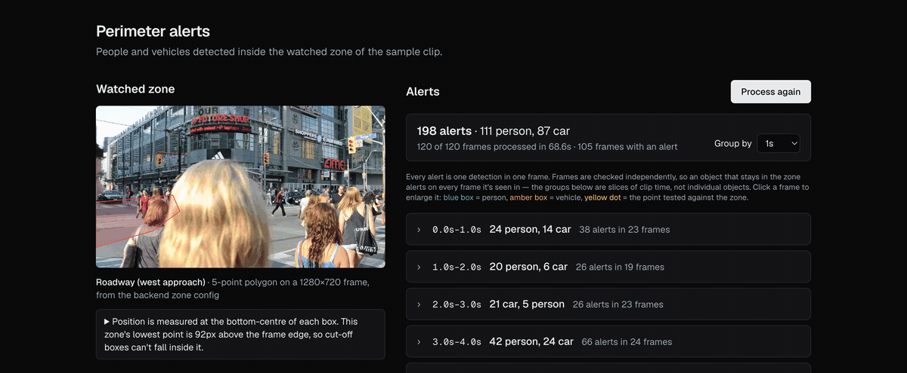

# Perimeter Anomaly Detection

Detects people and vehicles in a recorded video clip and raises a timestamped
alert, with a snapshot, whenever one is inside a configured zone — so a person
reviews the moments that matter instead of hours of footage.

**Live demo:** https://perimeter-anomaly-detection.vercel.app — upload your
own clip (up to 60 s), choose what to look for (people, vehicles, bicycles,
animals, bags), and get back timestamped alerts with snapshots and colours —
filterable by class and colour; or run the built-in sample clip. Expect
about **1 minute for a 20 s clip and 4 minutes for a 1-minute 1080p clip**
(see [Uploads](#uploads--limits-and-measured-timing)).
Backend: https://perimeter-backend-ax3a.onrender.com/health



*The demo is a sequence of screenshots taken during one real run on the
deployed site (2026-09-24), stitched into a GIF — not a screen recording, so
the ~70 s wait is compressed; the live timer in the frames shows the real
elapsed time.*

- **Backend** (`backend/`): FastAPI, YOLO26-N (Ultralytics) for detection,
  OpenCV for video, managed with `uv`, deployed as a Docker image on Render.
- **Dashboard** (`frontend/`): Next.js on Vercel — process the clip, review
  alerts grouped by time, see the zone drawn over the frame.

Scope, design and the day-by-day plan: [`docs/PROJECT.md`](docs/PROJECT.md),
[`docs/SPEC.MD`](docs/SPEC.MD).

## What this project deliberately does not do

- **No live camera input.** It processes one recorded clip. Live camera
  support is a planned next step — the design is written up in
  [`docs/PROJECT.md`](docs/PROJECT.md) ("Day 6") — but it is **not built**.
- **No evaluation against an academic dataset.** The test footage is a
  royalty-free (CC0) street clip, chosen to avoid the registration friction of
  datasets like i-LIDS or VIRAT. That is a deliberate scope decision, not an
  oversight — and it means this project makes **no accuracy claims**.
- **No long videos.** Uploads are limited to 60 s (see
  [Uploads](#uploads--limits-and-measured-timing) for why, and what longer
  would take).
- **No drawn zones for uploads.** An uploaded clip is watched across the whole
  frame; there is no zone editor yet. Only the sample clip has a drawn zone.
- **No car make/model** (a possible later phase, low-confidence), and **no
  licence plate recognition** (not planned).
- **A limited set of things to look for.** The model can see 80 object types;
  uploads can alert on people, vehicles (car, truck, bus, motorcycle),
  bicycles, dogs, cats, backpacks, handbags and suitcases. The sample clip
  sticks to people and vehicles, so a handbag in its zone is not an
  "intrusion".
- **Colours are estimates, not facts** — see [Colours](#colours--what-they-are-and-where-they-break).
- **No tracking across frames**, and **no identification** of who someone is:
  it only ever answers "something entered the zone".

## Uploads — limits and measured timing

Upload a clip, choose what to alert on — **people**, **vehicles** (car, truck,
bus, motorcycle), **bicycles**, **dogs**, **cats**, **backpacks**, **handbags**,
**suitcases**, any combination — and the whole frame is watched. Processing runs as a background
job: the upload returns a job id immediately and the dashboard polls for
progress (`queued` → `processing` → `complete` / `failed`). The page URL
carries the job id (`?job=…`), so it can be reloaded or come back to later.

**Limits** (enforced by the server, published at `GET /uploads/limits`):
100 MB, 60 s, up to 1920×1080 in either orientation, up to 60 fps; MP4/MOV,
WebM/MKV, AVI or MPEG-TS. Uploads are checked at **2 frames per second of
video** (the sample clip checks every frame) — a walking person moves about
0.7 m between checks, so entries into view are still caught.

**Measured on the deployed site** (Render free tier + R2, 2026-09-24):

| Clip | Upload* | Processing | Saving results | Upload to results |
|---|---|---|---|---|
| 20 s, 720p, 9.3 MB | 14.7 s | 38.8 s | 5.7 s | **61.5 s** |
| 56 s, 1080p, 72.7 MB | 94.7 s | 147.2 s | 9.1 s | **253.1 s (4.2 min)** |

\*Upload time is the uploader's connection (here ~6–9 Mbit/s up; the same
72.7 MB file took 67–95 s across runs).

Processing costs roughly **2–2.75 s per second of video** on the free tier,
at 2 checks per second. So longer videos are possible in principle but not
practical here: a 5-minute 1080p clip would take ~14 minutes, an hour ~2.75
hours — and a long job blocks everyone else's (there is one worker), the
free instance can go to sleep mid-job if nobody is watching it, and a busy
hour would produce tens of thousands of alerts. Raising the limit to a few
minutes is realistic; an hour needs a different architecture (direct-to-R2
uploads, a separate resumable worker, paid compute).

**Validation** — each of these fails clearly, and leaves nothing behind:
not a video (checked from the file's first bytes: OpenCV alone would open a
JPEG or GIF) → `415`; over 100 MB → `413`; unreadable, too long, too
high/low resolution or frame rate → `422` with the numbers; damage further
into the file (a truncated upload) → the job fails with the reason. The
dashboard also checks size and type before uploading, so an oversized file is
refused instantly rather than after a long upload (the host receives the
whole request before the server can refuse it — measured).

**Storage.** Render's free tier has no persistent disk: the filesystem is
wiped on every restart, redeploy and idle spin-down. So job records, alerts,
snapshots and the reference frame are kept in **Cloudflare R2**; the uploaded
video itself exists only on the server's disk while its job runs. Snapshots
are served as **signed links that expire after 6 hours**; the bucket is
private. Finished jobs survive restarts (verified by redeploying mid-test); a
job cut off by a restart is reported as failed with that reason. Results are
deleted after **7 days** by a lifecycle rule on the bucket.

**Privacy.** There are no accounts. A job's results are visible to anyone who
has its link (the id is 128 random bits, so it can't be guessed), for 7 days.

## Colours — what they are, and where they break

Every alert records a colour: **one colour** for a vehicle or object, **top
and bottom clothing colours** for a person. The results view can filter by
class and colour ("red cars", "people with a blue top").

**How:** plain HSV thresholds over the pixels in the middle of the detection
box (the edges are mostly background), computed on the full-resolution frame
while the clip is processed. No extra model. The answer is one of 11 fixed
names — black, white, gray, red, orange, yellow, green, blue, purple, pink,
brown (silver cars read as gray) — or:
- **mixed**: no colour clearly dominates (a two-tone car, a patterned top);
- **unknown**: too little to judge — a tiny box, a person under 150 px tall,
  or a black-and-white (infrared) frame.

Neither is ever matched by a colour filter: when the answer is uncertain, the
alert is left out of a colour search rather than put in the wrong one.

**Measured on real footage** — crops from the 56 s daytime source clip,
labelled by eye; rules were tuned on one set and checked on a separate,
held-out set (the held-out numbers are the honest ones):

| | Right | "mixed" / unknown | Wrong | Precision when a colour is named |
|---|---|---|---|---|
| Vehicles, held-out (32) | 22 | 8 | 2 | **92%** |
| Clothing, held-out people ≥150 px (42 regions) | 28 | 11 | 3 | **90%** |

Checked by eye through the dashboard, on the same clip:
- **"blue cars"**: of the first 40 results, about 33 were blue, navy or teal
  cars and about 5 were white or silver cars in shade;
- **"people with a blue top"** (live site): of the first 30 results, about 21
  right, 6 wrong, 3 ambiguous — roughly **75–80%**, lower than the overall
  clothing figure. Blue is the hardest colour: shade tints white towards it,
  and lavender/purple shirts sit right next to it in hue;
- **"red vehicles"** returns nothing on this clip — correct, it has no red
  cars. Red cars were read correctly (2 of 2) in the night street clip.

**Where it holds up:** daylight; strongly coloured cars and clothes (red,
blue, orange, green); black cars and black clothing; white cars and shirts
with some sun on them; black bags.

**Where it visibly doesn't** (seen on real footage, not guessed):
- **White in shade reads blue.** Shade outdoors is lit by the sky, which
  tints white and silver faintly blue — the main source of wrong "blue cars".
  A rule to correct it was tried and rejected: it fixed those but caused more
  errors elsewhere.
- **Night, under street lights** (a CC BY-SA 4.0 street clip): red and black
  cars were still right, but **white cars read gray** (4 of 5) — they never
  get bright enough.
- **Dusk / warm light** (a CC BY 3.0 time-lapse): a **white truck read pink**
  — exactly the "white car under a sunset" failure.
- **Infrared night mode** (a public-domain Dahua CCTV sample): the image is
  black and white, so there is no colour to read. The whole frame is detected
  as black-and-white and every colour is reported as **unknown** instead of
  "gray" — so night footage from most security cameras simply has no colours.
- **Small objects include what's around them:** a handbag's box contains the
  person carrying it, so a black bag against denim can read blue.
- **Patterned clothing, bare legs under shorts, people half-hidden behind
  others**: usually "mixed", sometimes wrong.
- **Distant people** (<150 px tall): no clothing colour is given — on real
  footage they produced far more false "blue tops" than larger people.

**Cost:** colour extraction measured at **0.36 ms per alert** on a laptop and
**0.63 ms** in the container limited to 1 CPU — about 0.8 s for the 1,286
alerts of the 56 s clip. **On the deployed free tier it made no measurable
difference** (same clips, same classes, 2026-09-25):

| Clip | Processing, Phase 1 runs | Processing, with colours |
|---|---|---|
| 20 s, 720p | 37.3, 38.0, 38.8 s | 37.4 s |
| 56 s, 1080p | 147.2, 155.0, 155.4 s | 155.4 s |

Both fall inside Phase 1's run-to-run range, so the 60 s upload cap and the
timing table under [Uploads](#uploads--limits-and-measured-timing) still
stand. Jobs processed before colours existed still open (verified live):
their alerts show no colours and the view says colours weren't recorded.

## License — AGPL-3.0, and what it means

Detection uses **Ultralytics YOLO26**, and both the `ultralytics` package and
the YOLO26 weights are licensed under **AGPL-3.0**. For this project that is
fine: it is open source and public.

It would **not** be fine for a closed-source commercial product. AGPL-3.0
requires that anyone who uses the software over a network can get the
complete source of the whole application, under the same license. A company
wanting to ship this in a proprietary product or service would need an
**Ultralytics Enterprise License** instead (or a detection model under a
permissive license).

The sample clip is CC0 (public domain) — provenance in
[`backend/app/data/sample_clip/SOURCE.md`](backend/app/data/sample_clip/SOURCE.md).

## Processing time — measured, not assumed

This is **not real-time**. Detection runs on the CPU, one frame at a time.
All numbers are for the committed sample clip: 5 s of video, 120 frames at
1280×720, every frame processed.

### Deployed (Render free tier) — measured 2026-09-24

| | |
|---|---|
| Server-side processing, 8 runs | **64.2 – 70.2 s** |
| What a user waits (button press → results shown), 4 runs | 67.2 – 71.1 s |
| Render's documented maximum HTTP response time | 100 minutes ([source](https://render.com/docs/render-vs-vercel-comparison)) |

About 70 s is far inside Render's documented limit, so the synchronous
`POST /clips/{id}/process` design holds up for this clip — but it is a real
wait, and it scales linearly with clip length: a clip a few minutes long would
take tens of minutes, at which point a process-then-poll design would be
needed. The requests pass through Cloudflare in front of Render; the longest
request actually exercised is ~71 s, so the 100-minute figure is Render's
documentation, not something tested here.

Not measured: cold start after the free instance spins down from inactivity,
and memory use on Render (locally, the container peaks at ~434 MiB while
processing; the free tier allows 512 MB).

### Local

| Where | Processing |
|---|---|
| Native, laptop (Apple M2, 8 cores), server warm | **3.2 – 3.3 s** (range across all runs: 3.2 – 4.7 s) |
| Docker image on the same laptop, no CPU limit | ~10 s |
| Docker image, limited to 1 CPU | ~11 s |
| Docker image, limited to 0.5 CPU | ~28 s |

The container is slower than native for identifiable reasons: macOS decodes
the video in hardware (0.14 s vs 1.4 s in the container) and its PyTorch build
uses different math libraries (inference 34 vs 65 ms/frame).

**A CPU-limit bug found and fixed on the way (Day 5).** Ultralytics sets
PyTorch's thread count from the machine's core count — but inside a container
that is the *host's* core count, not the container's CPU allowance. Limited to
1 CPU, the container ran 7 inference threads fighting over it: **173 s** for
the clip. The detector now reads the container's CPU limit and uses that many
threads (and idle threads sleep instead of spinning): **10.7 s** under the same
limit. `/health` reports the thread count in use (`inference_threads`).

### Results differ slightly between platforms

Same code, clip and weights; the PyTorch builds differ (macOS vs Linux CPU-only), and so do their floating-point results:

| Where | Alerts |
|---|---|
| Native macOS | 202 (112 person, 90 car) |
| Deployed on Render (Linux, CPU-only PyTorch) | 198 (111 person, 87 car) |

195 alerts match (same frame and class, boxes within a few pixels); every difference is a borderline case — a
detection within a hair of the 0.35 confidence cut-off, a person standing on
the zone boundary, or which of two duplicate boxes on one car survives. The
alert list is reproducible to within those cases, not bit-for-bit across
platforms.

## Running locally

```sh
# Backend — http://localhost:8000
cd backend
uv sync
uv run python -c "import os; os.environ['YOLO_CONFIG_DIR']='models'; from ultralytics import YOLO; YOLO('models/yolo26n.pt')"  # fetch weights once
uv run uvicorn app.main:app --port 8000

# Dashboard — http://localhost:3000
cd frontend
npm install
npm run dev
```

Or run the backend exactly as deployed:

```sh
cd backend
docker build -t perimeter-backend .          # weights are baked into the image
docker run --rm -p 8000:8000 perimeter-backend
```

The dashboard calls the API at `NEXT_PUBLIC_API_URL` (default
`http://localhost:8000`; see `frontend/.env.example`). It is inlined at
**build** time, so a deployed frontend must have it set before building. The
API only accepts browser requests from the origins in `PERIMETER_CORS_ORIGINS`
(default `http://localhost:3000`).

If the model weights are missing or corrupt, the backend still starts:
`GET /health` reports `"model_loaded": false` with the reason, and processing
requests return `503` with the same message.

## Deployment

- **Backend — Render**, Docker runtime, Root Directory `backend`, free
  instance, health check `/health`, env `PERIMETER_CORS_ORIGINS` set to the
  Vercel origin. The image runs as a non-root user and has the YOLO26-N
  weights baked in at build time, so a cold start never downloads them.
- **Frontend — Vercel**, Root Directory `frontend`, env `NEXT_PUBLIC_API_URL`
  set to the Render URL before the build. **Deploy the frontend together with
  the backend when the API changes shape**: Phase 2 changed a job's `classes`
  from one value to a list, and for a while the live site ran the Phase 1
  frontend against the Phase 2 API — every job page failed to render until
  Vercel redeployed from `main`.
- **Upload results — Cloudflare R2**: a private bucket with a lifecycle rule
  deleting objects after 7 days, and an API token with Object Read & Write on
  that bucket only. On Render, set `PERIMETER_R2_ENDPOINT`
  (`https://<account-id>.r2.cloudflarestorage.com`), `PERIMETER_R2_BUCKET`,
  `PERIMETER_R2_ACCESS_KEY_ID` and `PERIMETER_R2_SECRET_ACCESS_KEY`. All four
  or none: a partial set is refused at startup. Without them the server keeps
  results on local disk (development only — they don't survive a restart).
  `/health` reports which is in use (`"storage": "r2"`) and, if the bucket
  isn't reachable, why — in which case uploads return `503`.
- The **sample clip**'s last result is kept in memory only: a restart forgets
  it, and the dashboard shows "not processed yet" until someone presses the
  button again.

## Tests

```sh
cd backend && uv run pytest        # 361 tests; no model weights, no bucket, no network
cd frontend && npm test            # alert grouping logic

# Inside the Docker image, as its non-root user:
cd backend && docker build --target test -t perimeter-test . && docker run --rm perimeter-test
```

Deprecation warnings fail the backend suite on purpose, so new ones get fixed
instead of piling up in the output. Two tests simulate a disk refusing writes
using directory permissions; they skip when run as root, which is one reason
the image runs as a non-root user (inside it, all tests run).

## Known limitations

- **No tracking across frames.** Every alert is one detection in one frame, so
  a car waiting in the zone alerts on every frame it is visible in. The
  dashboard groups alerts by time to keep this reviewable.
- **Objects cut off by the bottom of the frame.** Position is measured at the
  bottom-centre of each box; for a box cut off by the frame edge, that point
  sits on the edge rather than at the object's real feet. The dashboard flags
  affected alerts and warns when a zone reaches the bottom edge.
- **Slow on the free tier**: ~70 s for the 5 s sample clip (checked every
  frame), about 1 minute of processing per 20–25 s of uploaded video.
- **One upload processed at a time**; up to 3 can wait, a 4th gets "busy,
  try again".
- **One committed sample clip**; not benchmarked against an academic dataset.
